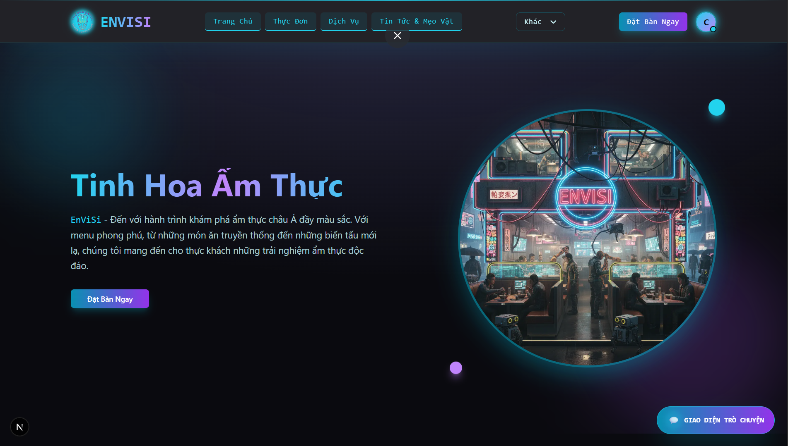
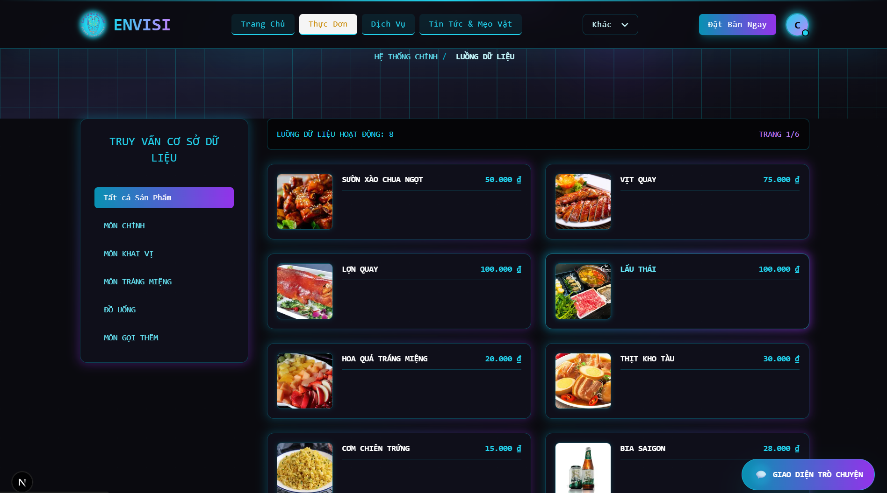
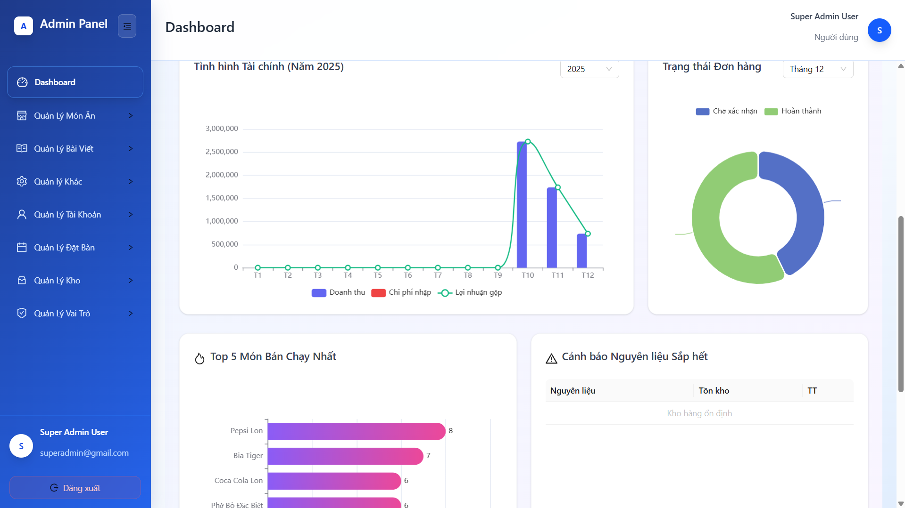
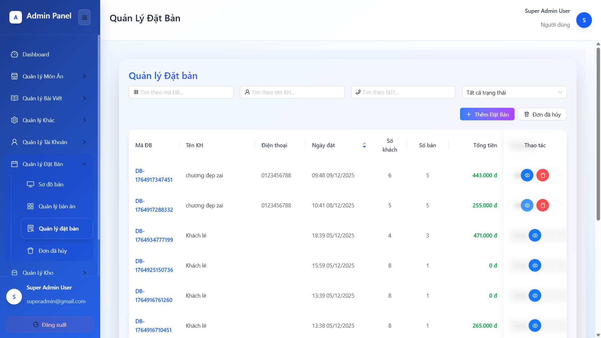

# 🍽️ ENVISI - Hệ thống Website Quản lý Nhà hàng


> **ENVISI** là giải pháp quản lý nhà hàng toàn diện, tập trung hóa quy trình vận hành từ đặt bàn, gọi món (Order) đến quản lý kho và báo cáo doanh thu. Hệ thống giúp tối ưu hóa hiệu suất phục vụ, giảm thiểu sai sót thủ công và nâng cao trải nghiệm thực khách.

---

## 🚀 Giới thiệu

Trong bối cảnh ngành F&B chuyển đổi số mạnh mẽ, **ENVISI** ra đời nhằm giải quyết các bài toán về quản lý rời rạc, thủ công tại các nhà hàng vừa và nhỏ. Dự án xây dựng một hệ thống khép kín kết nối các bộ phận: **Lễ tân - Bàn - Bếp - Thu ngân**.

**Mục tiêu chính:**
* ✅ Tự động hóa quy trình đặt bàn và gọi món.
* ✅ Đồng bộ dữ liệu thời gian thực (Real-time) giữa các bộ phận.
* ✅ Minh bạch hóa quản lý tài chính và kho nguyên liệu.

---

## 🛠 Công nghệ sử dụng

Dự án được xây dựng trên nền tảng **MERN Stack** (mở rộng với Next.js & MySQL) theo kiến trúc 3 tầng (3-Tier Architecture).

### Front-end (Client-side)
*  **Next.js**: Framework chính, hỗ trợ SEO và Server-Side Rendering (SSR).
*  **TypeScript**: Đảm bảo type-safety cho mã nguồn.
*  **TailwindCSS**: Thiết kế giao diện Responsive.
* 🐻 **Zustand**: Quản lý trạng thái (State Management).

### Front-end (Admin-side)
*  **ReactJS**: Xây dựng giao diện quản trị SPA.
* ⚡ **Vite**: Build tool thế hệ mới, tối ưu tốc độ phát triển.
* 🟣 **Redux Toolkit**: Quản lý trạng thái phức tạp cho Dashboard.

### Back-end & Database
*  **Node.js** & **ExpressJS**: Xây dựng RESTful API.
*  **MySQL**: Hệ quản trị cơ sở dữ liệu quan hệ.
* 💎 **Prisma ORM**: Tương tác với Database và quản lý migration.
* 🔥 **Firebase**: Lưu trữ hình ảnh và media.

---

## ✨ Tính năng chính

### 1. Phân hệ Khách hàng (Client)
* **Trang chủ & Giới thiệu:** Xem thông tin nhà hàng, món Best Seller.
* **Thực đơn điện tử:** Xem danh sách món ăn, lọc theo danh mục.
* **Đặt bàn Online:** Chọn ngày, giờ, vị trí bàn.
* **Tin tức:** Blog ẩm thực, công thức nấu ăn.

| Trang chủ | Thực đơn |
| :---: | :---: |
|  |  |

### 2. Phân hệ Quản trị (Admin)
* **Dashboard:** Thống kê doanh thu, lượng khách, món bán chạy.
* **Quản lý Đặt bàn & Sơ đồ bàn:** Xếp bàn, kiểm tra trạng thái bàn, in hóa đơn.
* **Quản lý Thực đơn:** CRUD món ăn, danh mục.
* **Quản lý Kho:** Theo dõi nguyên liệu, cảnh báo tồn kho.
* **Phân quyền (RBAC):** Quản lý vai trò nhân viên.

| Dashboard | Quản lý Đặt bàn |
| :---: | :---: |
|  |  |

---

## 🏗 Kiến trúc hệ thống


### Cấu trúc thư mục
Mã nguồn được tổ chức theo mô hình Monolithic, tách biệt rõ ràng giữa các services:

```bash
├── Client/         # Mã nguồn trang dành cho Khách hàng (Next.js)
│   ├── src/app/    # Các trang: About, Account, Blog...
│   ├── src/store/  # Zustand stores (Auth, Booking...)
│
├── Admin/          # Mã nguồn trang Quản trị (React + Vite)
│   ├── src/pages/  # Các màn hình: POS, Products, Inventory...
│   ├── src/features/# Redux slices
│
├── Server/         # Mã nguồn Backend (Node.js + Express)
│   ├── src/controllers/ # Xử lý logic điều hướng
│   ├── src/services/    # Logic nghiệp vụ cốt lõi
│   ├── src/models/      # Định nghĩa dữ liệu
│   ├── prisma/          # Schema Database & Migrations

```
yaml
Sao chép mã

### Cơ sở dữ liệu
Sử dụng **MySQL** với các bảng chính:  
`Users`, `Products`, `Categories`, `Tables`, `Reservations`, `Inventory`, `Reviews`, ...

---

## 💻 Cài đặt và Triển khai

### Yêu cầu
- Node.js 18+
- MySQL 8+
- Git

---

### **Bước 1: Clone dự án**
```bash
git clone https://github.com/chuong-gif/restaurant-app.git
cd restaurant-app
```
### Bước 2: Cài đặt dependencies

Chạy lệch
```bash
npm install
```
ở thư mục gốc restaurant-app


### Bước 3: Cấu hình biến môi trường (.env)

Dự án yêu cầu thiết lập biến môi trường riêng cho từng thư mục: **Server**, **Client**, **Admin**.  
Tạo file `.env` hoặc `.env.local` trong từng thư mục và điền các thông số sau.

---

## 1. Backend (Thư mục `/Server`)

Tạo file `.env` và cấu hình kết nối Database, JWT, Email và Thanh toán:

```properties
# Cấu hình Server & Database
PORT=3307
DATABASE_URL="mysql://root:@localhost:3306/restaurant_db"

# Bảo mật (JWT)
JWT_SECRET_KEY="your_super_secret_key_change_this"

# Cấu hình gửi Email (Nodemailer)
EMAIL_USERNAME="your-email@gmail.com"
EMAIL_PASSWORD="your-app-password"
CONTACT_EMAIL_RECIPIENT="admin-email@example.com"

# Cấu hình thanh toán MoMo (Tùy chọn)
MOMO_ACCESSKEY="your_momo_access_key"
MOMO_SECRETKEY="your_momo_secret_key"
MOMO_REDIRECT_URL="http://localhost:3000/confirm"
MOMO_IPN_URL="https://your-domain.com/api/payment/callback"
```

---

## 2. Frontend Client (Thư mục `/Client`)

Tạo file `.env.local` để cấu hình API và Firebase:

```properties
# API Backend
NEXT_PUBLIC_API_BASE_URL_CLIENT=http://localhost:3307/api/v1
API_BASE_URL_SERVER=http://127.0.0.1:3307/api/v1

# Firebase Client Config
NEXT_PUBLIC_FIREBASE_API_KEY=AIzaSy...
NEXT_PUBLIC_FIREBASE_AUTH_DOMAIN=your-app.firebaseapp.com
NEXT_PUBLIC_FIREBASE_PROJECT_ID=your-app-id
NEXT_PUBLIC_FIREBASE_STORAGE_BUCKET=your-app.appspot.com
NEXT_PUBLIC_FIREBASE_MESSAGING_SENDER_ID=...
NEXT_PUBLIC_FIREBASE_APP_ID=...
NEXT_PUBLIC_FIREBASE_MEASUREMENT_ID=...
```

---

## 3. Frontend Admin (Thư mục `/Admin`)

Tạo file `.env` (Vite yêu cầu prefix `VITE_`):

```properties
# API Backend
VITE_API_BASE_URL=http://localhost:3307/api/v1

# Firebase Admin Config
VITE_FIREBASE_API_KEY=AIzaSy...
VITE_FIREBASE_AUTH_DOMAIN=your-app.firebaseapp.com
VITE_FIREBASE_PROJECT_ID=your-app-id
VITE_FIREBASE_STORAGE_BUCKET=your-app.appspot.com
VITE_FIREBASE_MESSAGING_SENDER_ID=...
VITE_FIREBASE_APP_ID=...
VITE_FIREBASE_MEASUREMENT_ID=...
```

---

Nếu bạn muốn mình tạo luôn bản **tối giản**, **bản giải thích**, hoặc **bản dành cho người mới (step-by-step)**, mình có thể chỉnh thêm.

### Bước 4: Khởi tạo Cơ sở dữ liệu (Database)

1. Mở **phpMyAdmin** trong XAMPP và tạo cơ sở dữ liệu mới tên **`restaurant_db`**.  
2. Import file **`restaurant_db.sql`** được cung cấp trong đồ án để tạo bảng và dữ liệu mẫu.  
3. Tại thư mục gốc **`restaurant-app`**, chạy các lệnh sau để Prisma đồng bộ schema với MySQL:

```bash
npx prisma generate
npx prisma migrate dev --name init
```

### Bước 5: Chạy dự án
Để chạy toàn bộ chương trình thì chạy lệch
```bash
npm run dev
```
ở thư mục gốc restaurant-app
Đường dẫn:

Client: http://localhost:3000

Admin: http://localhost:5173

Server: http://localhost:3307

## 🔌 API Documentation

<details>
  <summary><strong>Danh sách API chính</strong></summary>

### Auth
| Method | Endpoint                | Mô tả       | Auth |
|--------|-------------------------|-------------|------|
| POST   | /api/v1/auth/login      | Đăng nhập   | ❌   |
| POST   | /api/v1/auth/register   | Đăng ký     | ❌   |

---

### Products
| Method | Endpoint                         | Mô tả           | Auth |
|--------|----------------------------------|------------------|------|
| GET    | /api/v1/public/products          | Danh sách món   | ❌   |
| POST   | /api/v1/admin/products           | Thêm món        | ✅   |
| PUT    | /api/v1/admin/products/:id       | Cập nhật món    | ✅   |

---

### Reservations
| Method | Endpoint                         | Mô tả              | Auth |
|--------|----------------------------------|---------------------|------|
| POST   | /api/v1/public/reservations      | Khách đặt bàn      | ❌   |
| GET    | /api/v1/admin/reservations       | Danh sách đặt bàn  | ✅   |

---

### Inventory
| Method | Endpoint                           | Mô tả      | Auth |
|--------|--------------------------------------|------------|------|
| POST   | /api/v1/admin/inventory/import       | Nhập kho   | ✅   |

---

### Statistics
| Method | Endpoint                               | Mô tả        | Auth |
|--------|------------------------------------------|--------------|------|
| GET    | /api/v1/admin/statistical/overview       | Thống kê     | ✅   |

</details>

## 👥 Đội ngũ phát triển

| Thành viên        | Vai trò            | Phụ trách                                 | Email              |
|-------------------|--------------------|---------------------------------------------|---------------------|
| Ngô Văn Chương    | Leader / Fullstack | Auth, Đặt bàn, Kho, DB & API Design        | 2312588@dlu.edu.vn |
| Nguyễn Văn An     | Backend / Tester   | Blog, Comment, Content                      | 2312565@dlu.edu.vn |
| Hồ Sĩ Tuấn Đạt    | Frontend / UI/UX   | Dashboard, Statistics, Charts               | 2312594@dlu.edu.vn |
| Đinh Anh Lộc      | Backend / Tester   | Product API, Categories, Filter             | 2312671@dlu.edu.vn |


🔮 Hướng phát triển
 Tối ưu hiệu năng (Redis Cache)

 AI gợi ý món ăn, dự báo kho

 Mobile App cho nhân viên

 Tích hợp thanh toán (VNPay, Momo)

🙏 Lời cảm ơn
Xin gửi lời cảm ơn đến TS. Nguyễn Thị Lương đã hướng dẫn và hỗ trợ nhóm trong suốt quá trình thực hiện dự án.

<p align="center"><i>Đà Lạt, 2025 - Developed by ENVISI Team</i></p> ```